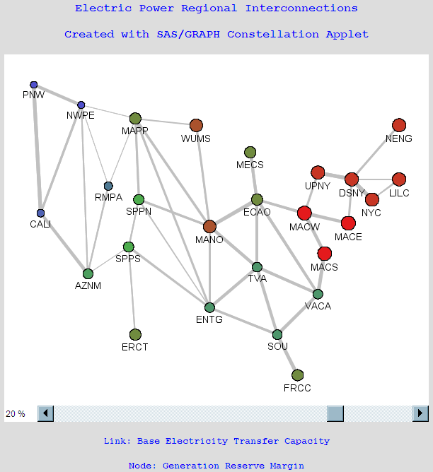
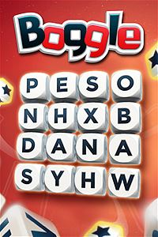

#  Graphs

## Resources
* [Wikipedia: Graph (abstract data type)](https://en.wikipedia.org/wiki/Graph_(abstract_data_type))

The Graph data structure is extremely powerful. A Graph is made up of nodes and
edges. Nodes represent elements in the graph. Edges represent relationships
between the elements in the graph.

Nodes are drawn with circles. Edges are the lines between nodes.
Edges can either point in one direction, or they can be two-way and point in
both directions.  Edges can have a "weight" value associated with them. Edges
don't have to have weights.

Here's what one graph looks like. Notice that node 14 has an edge with weight
`0` that points back to itself.

Graphs can represents lots of things:
* Nodes could represent people and edges could represent friendships between people.
  * If edges only go in one direction then it's like one Twitter user following
    another without being following back.
  * If edges are bi-directional then it's like Facebook friendships where
    friendships go in both directions.
* Nodes could represent states and edges could represent whether or not two
  states border each other.
* Nodes could represent street intersections and edges could represent one and
  two way streets between intersections. Weight values attached to each edge
  could represent the length of each road.

Here's a picture of a graph representing electrical power systems in the United
States.

Notice that Linked Lists and Trees are actually technically graphs! Like
a square is a rectangle, a Linked List is a graph. Linked Lists and Trees are
more specific versions of a graph. Graphs enforce much less structure on their
nodes and edges.

### Common Graph Algorithms
Mathematicians and computer scientists have studied graphs for a long, long
time. People have devised lots of algorithms for graphs. Here's a few:

* **Breadth First Traversal** - search the graph searching through close
  neighbors first.
* **Depth First Traversal** - search the graph going all the way in one
  direction before coming back and trying another direction.
* **Longest Path** - find the longest number of connected edges in a graph (who
  has the longest road in Settlers of Catan?)
* **Minimum Spanning Tree** - return the smallest number of edges that connects
  every node in the graph
* **Find Islands** - group nodes in a graph into sets of nodes that are
  connected together and not connected to other nodes.
* **Djikstra's Algorithm** - find the shortest route between any two nodes in
  the graph.
* **Topological Sort** - if the nodes represent tasks, and their edges point to
  other tasks that need to be done first, then topologial sort creates a list
  of what order tasks should be done in. (lay foundation, then build frame,
  then put on siding, then paint.)

## Practical Application: Boggle!
You could use a graph to represent a Boggle board. Write an algorithm that
uses depth-first search from one letter and returns a list of possible words.
Words are created by walking up/down/left/right from one die and stringing
letters together to make a word. This problem requires reading in a dictionary
of words so you know if someone is a legitimate word or not.

