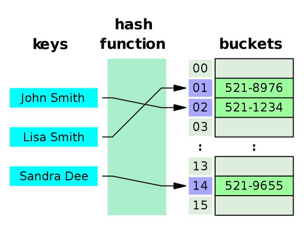

#  Hash Maps

Hash Maps (also called Hash Tables, or Dictionaries) are an extremely efficient
data structure offering `O(1)` insert, update, and delete operations.

A hash map basically stores key/value pairs in an array. However, the
location of the key/value pair in the array is determined by a hash function.
A hash function takes a key as input and returns an index in the array. The
index can be anywhere. Key/value pairs are not added in the order they
appear, nor are the key/value paris sorted. The index returned by the hash
function is always the same, given the same key.

1. Pass the `key` to the hash function to compute what index it should be stored at.
2. Use the index to save the key/value pair in the array

```
array_index = hash_function(key)
hash_table[array_index] = {key, value}
```

Using a hash function to determine where something should exist in array provides
us with the fast `O(1)` insert, update and delete operations. The hash function
tells us exactly what index to look at in the array. We don't have to waste time
searching through the array linearly. It's even faster than using binary search
to look for an item in a sorted array.

Here's how you can visualize the hash function. This hash table stores
names/phone numbers as key/value pairs. The String `John Smith` passes
through some hash function and it's index is computed as `02`. The 
phone number (and the key) is stored in the bucket at `02`.



## Hash Functions
First and foremost: programming wisdom dictates that no one should ever write
their own hash function. Very smart people have studied hash functions for a
long time. The hash functions we'll write here are simple, toy hash functions
so we can begin to develop our own understanding of how hash functions work.

Here's two simple hash functions for you to consider. We'll assume all of
the keys we're using are Strings for now.

1. Sum the ascii value of each character in the String.
2. Multiply together all the ascii values of each character in the String.

```
// sum up all the ascii values of every character in a string
// and turn it into an integer within the range of the hash table array
hash(String str) {
  int total = 0;
  for each str => chr {
    value = ascii_value(chr)
    total += value
  }

  // use modulus to make sure the computed total falls inside the
  // range of indexes of the underlying array
  index = total % data.length
  return index
}
```

# Challenge: Implement Hash Table
Implement a hash table using an array of fixed size when it's created.
Parameterize the constructor so the user can choose the size of the
array to begin with. Provide a default constructor that creates an array
of size `10`.

Configure your hash map to use Strings as keys initially.

Define a custom `.hash(String ss)` method that accepts a String and returns
an int. Use the int to choose an index in the fixed-size array. Here's two
ideas for how to convert a string into an int:

1. Sum the ascii value of each character in the String.
2. Multiply together all the ascii values of each character in the String.

Store a Linked List at each index of the array to be used for collisions.
Whenever a value is added at an index simply append it to the Linked List,
and store both the Key and the Value in the list so you can look up the
Value by it's key later.

# Stretch Goals
Configure your HashMap with Java Generics so it can associate any type of
Key and Value.

```
ADD HASHED: Pioneer Square= 1379
ADD HASHED: Alki Beach= 884
ADD HASHED: U District= 955

ADD INDEX: Pioneer Square= 92
ADD INDEX: Alki Beach= 92
ADD INDEX: U District= 64
```

```
MULT HASHED: Pioneer Square= 599126016
MULT HASHED: Alki Beach= 1062823936
MULT HASHED: U District= 578867200

MULT INDEX: Pioneer Square= 93
MULT INDEX: Alki Beach= 31
MULT INDEX: U District= 43
```

```
Bucket 0: []
Bucket 1: []
Bucket 2: []
Bucket 3: []
Bucket 4: []
Bucket 5: []
Bucket 6: []
Bucket 7: []
Bucket 8: []
Bucket 9: []
Bucket 10: []
Bucket 11: []
Bucket 12: [{South Lake Union->98109}]
Bucket 13: [{Madrona->98110}]
Bucket 14: []
Bucket 15: []
Bucket 16: [{Magnolia->98199}]
Bucket 17: []
Bucket 18: []
Bucket 19: [{Greenlake->98103}]
Bucket 20: [{Redmond->98052}]
Bucket 21: []
Bucket 22: []
Bucket 23: []
Bucket 24: [{Kirkland->98033}]
Bucket 25: []
Bucket 26: []
Bucket 27: []
Bucket 28: [{Bellevue->98005}]
Bucket 29: [{Seattle->98101}]
Bucket 30: []
Bucket 31: []
Bucket 32: []
Bucket 33: []
Bucket 34: []
Bucket 35: []
Bucket 36: [{Renton->98055}]
Bucket 37: [{Queen Anne->98109}]
Bucket 38: [{Capital Hill->98102}]
Bucket 39: []
Bucket 40: [{Freemont->98103}]
Bucket 41: []
Bucket 42: []
Bucket 43: []
Bucket 44: []
Bucket 45: []
Bucket 46: []
Bucket 47: [{Greenwood->98103},{Belltown->98121}]
Bucket 48: []
Bucket 49: [{Northgate->98125}]
Bucket 50: [{Bainbridge Island->98110}]
Bucket 51: []
Bucket 52: []
Bucket 53: [{Mercer Island->98040}]
Bucket 54: []
Bucket 55: []
Bucket 56: []
Bucket 57: []
Bucket 58: [{Mount Baker->98144}]
Bucket 59: []
Bucket 60: [{International District->98104}]
Bucket 61: []
Bucket 62: []
Bucket 63: []
Bucket 64: []
Bucket 65: [{Columbia City->98118}]
Bucket 66: [{Lynnwood->98037}]
Bucket 67: []
Bucket 68: []
Bucket 69: []
Bucket 70: []
Bucket 71: []
Bucket 72: [{Downtown->98101}]
Bucket 73: []
Bucket 74: []
Bucket 75: []
Bucket 76: []
Bucket 77: []
Bucket 78: []
Bucket 79: [{University District->98105}]
Bucket 80: []
Bucket 81: []
Bucket 82: []
Bucket 83: []
Bucket 84: [{West Seattle->98116}]
Bucket 85: []
Bucket 86: []
Bucket 87: []
Bucket 88: []
Bucket 89: []
Bucket 90: [{Laurelhurst->98105}]
Bucket 91: []
Bucket 92: [{Pioneer Square->98104},{Alki Beach->98116}]
Bucket 93: []
Bucket 94: []
Bucket 95: []
Bucket 96: [{Ballard->98107}]
Bucket 97: []
Bucket 98: []
```

```
Bucket 0: [{Renton->98055},{Capital Hill->98102},{Greenwood->98103},{Greenlake->98103},{Pioneer Square->98104},{University District->98105},{Columbia City->98118}]
Bucket 1: [{Bellevue->98005},{Seattle->98101}]
Bucket 2: [{Mercer Island->98040},{Alki Beach->98116},{Northgate->98125}]
Bucket 3: [{Downtown->98101},{Laurelhurst->98105},{Bainbridge Island->98110},{Magnolia->98199}]
Bucket 4: [{Kirkland->98033},{Lynnwood->98037},{Ballard->98107},{Queen Anne->98109},{West Seattle->98116}]
Bucket 5: [{International District->98104},{Mount Baker->98144}]
Bucket 6: [{Redmond->98052},{Freemont->98103},{South Lake Union->98109},{Madrona->98110},{Belltown->98121}]
```
