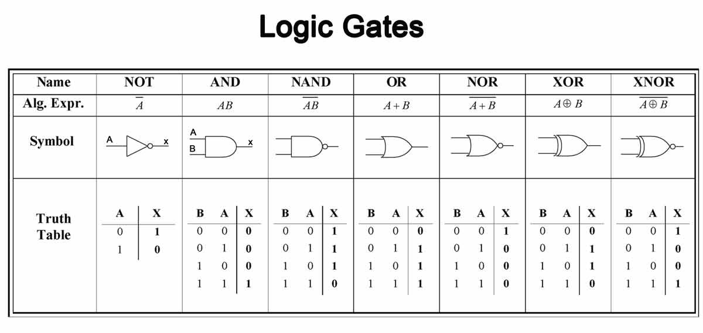
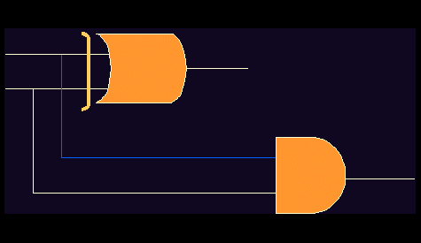
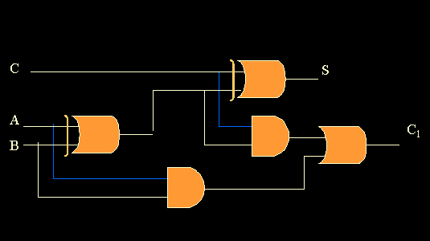

#  CPU Architecture, x86, the JVM and Kotlin

## Resources
* [How a CPU is Made](https://www.tomshardware.com/picturestory/514-intel-cpu-processor-core-i7.html)
* [CPU Architecture](https://www.tutorialspoint.com/computer_logical_organization/cpu_architecture.htm)
* [y86 Instruction Set](http://web.cse.ohio-state.edu/~reeves.92/CSE2421sp13/PracticeProblemsY86.pdf)
* [The Java Virtual Machine](https://www.geeksforgeeks.org/jvm-works-jvm-architecture/)
* [Kotlin Programming Language](https://en.wikipedia.org/wiki/Kotlin_programming_language#Philosophy)

## CPU Architecture
The CPU is the central processing unit of a computer. It's responsible for
performing all computation in your mchine. Let's look at the anatomy of a CPU
and see how these computers actually work.

Let's make a distinction between abstract idea-like things and the physical
implementations of these ideas. Here's a list of low-level to high-level ideas
that make up a computer. I say these are idea-like because we can talk about
how they should work and how we can use them without having to actually build
them. Throughout the history of computers engineers have had ideas of how to
use computers before figuring out machinery to actually build out their ideas.

* Abstract Zeros and Ones
* Abstract boolean logic (AND, OR, NAND, XOR gates)
* Abstract CPU instructions (x86)
* Abstract languages (Java)
* Abstract CPUs! (the Java Virtual Machine)
* Languages built on JVM (Kotlin)

Now Let's consider the physical aspects of these. 

* Physical Zeros and Ones
* Transistors (tiny switches triggered by eletrical signals)
* Physical logic gates
* Encoding CPU instructions
* Interpreting instructions
* Reading data, calculating data, writing data, storing data
* 

## Logic Gates
./assets/cpu_floorplan.jpg

* [Half Adder Circuit](http://isweb.redwoods.edu/INSTRUCT/CalderwoodD/diglogic/half-add.htm)
* [Full Adder Circuit](http://isweb.redwoods.edu/INSTRUCT/CalderwoodD/diglogic/full.htm)

## CPU Architecture
* [CPU Architecture](https://www.tutorialspoint.com/computer_logical_organization/cpu_architecture.htm)

The CPU operates in "ticks" or "cycles." It performs one operation at a time,
very very rapidly. CPUs have basically the following components:

* The **program counter** that keeps track of what position of code it's executing.
* Only a few **registers** that store intermediate values.
* Access to memory to read and write data beyond the few registers.
* Special **flags** to store information about the last operation
  * Was the last math operation equal to zero?
  * Was the last math operation negative?
  * Did the last math operation cause an integer overflow?
* The **ALU** arithmetic logic unit responsible for
  * addition
  * subtraction
  * increment
  * decrement
  * Bitwise AND, OR, XOR
  * Bit-shift operations

All these small operations come together to build impressive

## y86 Instruction Set
* [y86 Instruction Set](http://web.cse.ohio-state.edu/~reeves.92/CSE2421sp13/PracticeProblemsY86.pdf)

## The Java Virtual Machine: Why Java instead of C?
The C language depended on people writing compilers for every different CPU and
instruction set on the market. 

The Java Virtual Machine abstracted away the CPU so people could "write Java
programs once and then run them anywhere." Now only some programmers had to
write programs for the JVM that fit every CPU.
